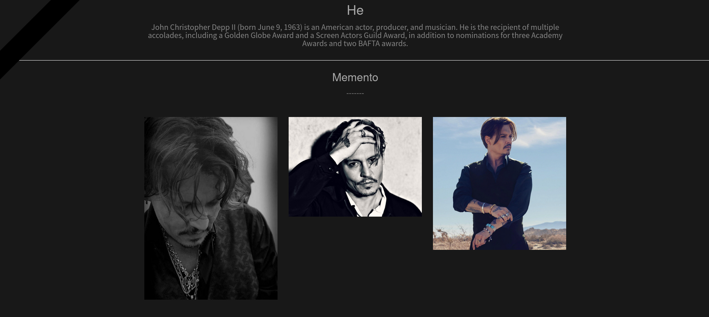
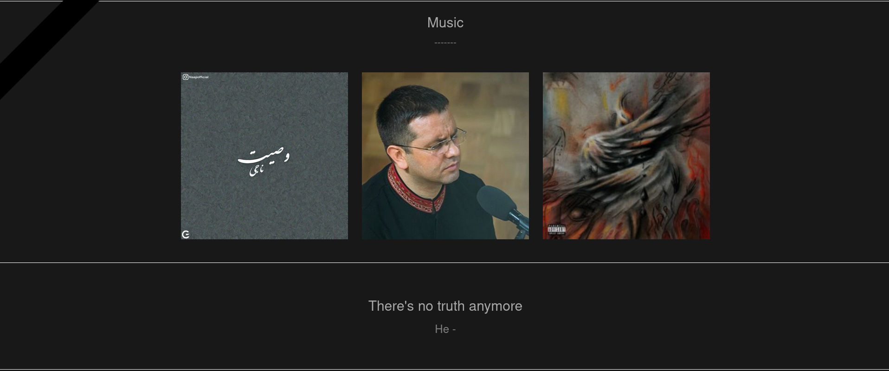

# Memorial

## General Information
- A project to keep alive the memory of loved ones.

## Technologies Used
- Python - version 3.8
- Flask  - version 2.1.3
- HTML,CSS

## Screenshots





## Setup
```bash
$ git clone https://github.com/0ne-zero/memorial.git
$ cd memorial
$ pip install -r requirements.txt
$ sudo chmod 755 main.py
$ python3 ./main.py
```
- There is just one template in [here](./static/template/), you can do whatever you want...
- For ease of work and to reduce dependencies, This project doesn't use any database for data storage.
- It's load data to memory from [this](./data.json) file.

## Contact
- Created by [Pouria Khakpour](https://github.com/0ne-zero) - feel free to contact me!
- You can reach me by pouria.khakpour9909@gmail.com
